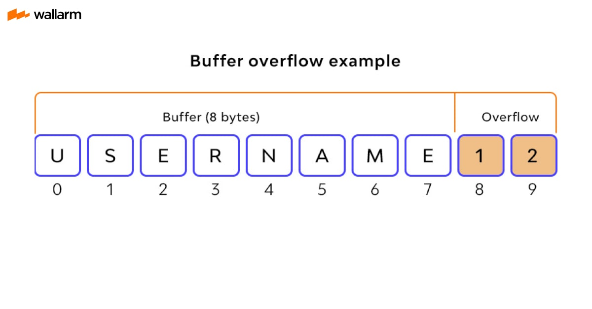

# 989 PoC Buffer Overflow :red_envelope:

## Prueba de concepto de desbordamiento de buffer



Ejemplo de overflow encontrado en la web

```C++
#include <bits/stdc++.h>

void overflow(char *character){
	// tenemos un buffer de 8 bytes
    char buffer[8];
	// en el cual con la función strcpy se realiza una copia
	// del párametro al array buffer. El desbordamiento
	// se produce cuando se trata de copiar datos 
	// con más de 8 bytes de tamaño
    strcpy(buffer, character);
}

// el programa recibe n cantidad de argumentos de m longitud
int main(int argc, char *argv[]){
    if (argc > 1){
		// la función overflow recibe el argumento
        overflow(argv[1]);
    }

    printf("entrada menor a 8\n");
}
```

```bash
./pocbuff ESTEARGUMENTOPROVOCADESBORDE
```

```text
*** stack smashing detected ***: terminated
Abortado ('core' generado)
```


**Manejo de Buffer Overflow con Scala**

implementación de código para evitar el BOF

```scala
package curso


object BufferOverflow {
    def overflow(word: Array[Char]): Unit ={
        val buffer: Array[Char] = new Array[Char](8)
        var sing: Int = 0
        val password = "contrase".toArray

        if ((word.deep != password.deep) && word.deep != 8){
            println("Contraseña Incorrecta")
        } else {
            println("Contraseña correcta")
            sing = 1
        }

        if (sing.equals(1)){
            println("Bienvenido")
        }

        // la función copyToArray() por defecto copia únicamente
		// los caractéres que pueda almacenar el array destino
		// evitando así el buffer overflow
        word.copyToArray(buffer)

        for (i <- buffer){
            print(i)
        }
        println("")


    }

    def main(args: Array[String]) = {
        print("Contraseña: ")
        val input = scala.io.StdIn.readLine()

        overflow(input.toArray)
    }
}

``` 

## ASCIInema: demostración de código en scala 🎥
[](https://asciinema.org/a/Fqp1i9k2Du3nSBoP8VG42khG6)