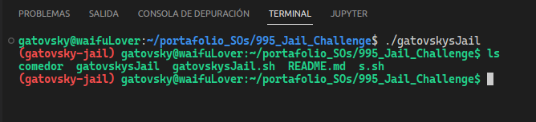

# Gatovsky-jail Challenge 😼

> Escapar nunca fue tan fácil como escribir un `exit`

## ¿Cómo funciona?

solamente ejecuta el binario

```bash
./gatovskysJail
```

comados a usar

```bash
ls
cd
base64
```




😑 Los permisos para ver y manipular los archivos deberían estar restringidos y solo ser accesibles por medio del binario, pero no los podría subir al github vea 

