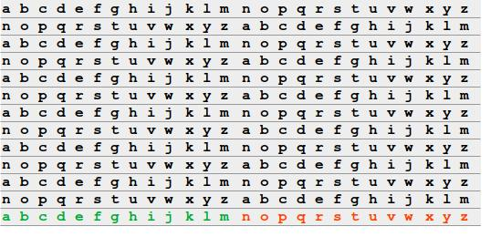

# Comandos usados en los niveles de Bandit

## Level 0 `->` 1

```bash 
du -a
cat $HOME/readme
NH2SXQwcBdpmTEzi3bvBHMM9H66vVXjL
exit
```

## Level 1 `->` 2

```bash
find . -type f -name - 2> /dev/null
cat ~/-
rRGizSaX8Mk1RTb1CNQoXTcYZWU6lgzi
exit
```

## Level 2 `->` 3

```bash
du -a
cat ./"spaces in this filename"
aBZ0W5EmUfAf7kHTQeOwd8bauFJ2lAiG
exit
```

## Level 3 `->` 4

```bash
ls -a ~/inhere
cat ~/inhere/.hidden
2EW7BBsr6aMMoJ2HjW067dm8EgX26xNe
exit
```

## Level 4 `->` 5

```bash
ls
cd inhere
#du -h
#du -a
#find . -type f -exec sh -c 'file -b {} &> /dev/null' \; -print
find . -type f | xargs file | grep text
cat ./-file07
lrIWWI6bB37kxfiCQZqUdOIYfr6eEeqR
exit
```

## Level 5 `->` 6

```bash
ls -a ~/inhere
#find . -size 1033 -type f | xargs file | grep text
find . -size 1033c -type f | xargs file | grep text
cat $HOME/inhere/maybehere07/.file2 
P4L4vucdmLnm8I7Vl7jG1ApGSfjYKqJU
exit
```

## Level 6 `->` 7

```bash
#find . -size 33c -user bandit7 -group bandit6 -type f
#find / -size 33c -user bandit7 -group bandit6 -type f
find / -size 33c -user bandit7 -group bandit6 -type f 2> /dev/null
ls -la /var/lib/dpkg/info/bandit7.password
cat /var/lib/dpkg/info/bandit7.password
z7WtoNQU2XfjmMtWA8u5rN4vzqu4v99S
exit
```

## Level 7 `->` 8

```bash
ls 
#cat data.txt
#cat data.txt | base64 -d
#cat data.txt | grep  millionth
#cat data.txt | grep -w  millionth
#cat data.txt | grep -w millionth | head -1
#cat data.txt | grep -w millionth | head -1 | awk {$2} | print
#cat data.txt | grep -w millionth | head -1 | awk {print $2}
cat data.txt | grep -w millionth | head -1 | awk '{print $2}'
TESKZC0XvTetK0S9xNwm25STk5iWrBvP
exit
```

## Level 8 `->` 9

```bash
ls
#cat data.txt | uniq -c
#sort data.txt | uniq
#sort data.txt | uniq -c
#awk '!x[$0]++' data.txt
#grep -wo data.txt | sort data.txt | uniq -c
#grep -wo data.txt | sort data.txt | uniq -c | awk '{if ($? == 0) print}'
#grep -wo data.txt | sort data.txt | uniq -c | awk '$1 ~ /1/ {print}' data.txt
#grep -wo data.txt | sort data.txt | uniq -c | awk '$1 == "1" {print $2}' data.txt
#grep -wo data.txt | sort data.txt | uniq -c | awk '$1 == "1" {print $2}'
#EN632PlfYiZbn3PhVK3XOGSlNInNE00t
sort data.txt | uniq -c | awk '$1 == 1 {print $2}'
EN632PlfYiZbn3PhVK3XOGSlNInNE00t
exit
```

## Level 9 `->` 10

```bash
ls
#cat data.txt
#grep "=====" data.txt
#xxd data.txt
#xxd data.txt | awk '{print $10}'
#xxd data.txt | awk '$10 ~ !/^==/ {print $10}'
#xxd data.txt | awk '($10 ~ /^[A-Za-z0-9\s]/ {print $10}'
#xxd data.txt | awk '($10 !~ /^=*/) && ($10 !~ /^.*/) {print $10}'
#xxd data.txt | awk '$10 !~ /*..*/ {print $10}' | grep -A 1 "========"
#xxd data.txt | awk '$10 !~ /^..*/ {print $10}' | grep -A 1 "========"
#xxd data.txt | awk '$10 !~ /...*/ {print $10}' | grep -A 1 "====="
#xxd data.txt | awk '{print $10}' | grep -A 1 "="
#xxd data.txt | awk '{print $10}' | grep -A 1 "^="
#xxd data.txt | awk '{print $10}' | grep -A 1 "^=" | tail -1
#6J3kTb8A7j9Lgryw
#6J3kTb8A7j9LgrywtEUlyyp6s
strings data.txt | awk '$1 ~/=/ {print $2}'
strings data.txt | awk '$1 ~ /=/ {print $2}' | grep "^G"
G7w8LIi6J3kTb8A7j9LgrywtEUlyyp6s
exit
```

## Level 10 `->` 11

```bash
base64 -d data.txt
base64 -d data.txt | awk '{print $4}'
6zPeziLdR2RKNdNYFNb6nVCKzphlXHBM
exit
```

## Level 11 `->` 12



```bash
#cat data.txt
#base64 -d data.txt | tr "A-Za-z" "N-ZA-Mn-za-m"
#cat data.txt | tr "A-Za-z" "N-ZA-Mn-za-m"
cat data.txt | tr "A-Za-z" "N-ZA-Mn-za-m" | awk '{print $4}'
JVNBBFSmZwKKOP0XbFXOoW8chDz5yVRv
exit
```
